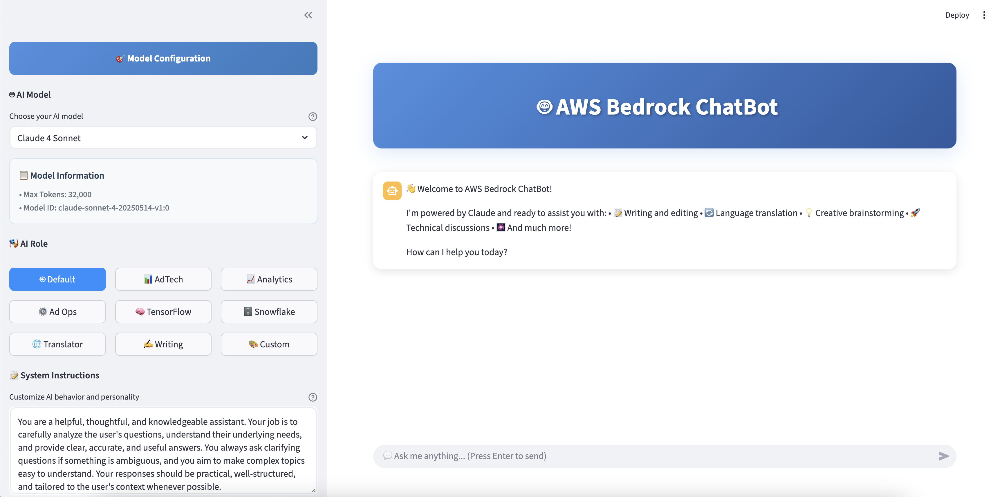

# 🤖 Bedrock ChatBot

A streamlined chat bot based on AWS Bedrock, built with Streamlit and LangChain.



## ✨ Features

- 🚀 **Multi-Model Support**: Supports Claude 3.5 Haiku, Claude 3.7 Sonnet, and Claude 4 Sonnet
- 🎭 **Role System**: Built-in role prompts (Translator, Writing Assistant, etc.)
- ⚙️ **Adjustable Parameters**: Support for temperature, top-p, top-k, and max_tokens tuning
- 💬 **Streaming Responses**: Real-time AI response display
- 🧠 **Reasoning Mode**: Support for Claude's reasoning capabilities
- 📱 **Responsive Design**: Modern Streamlit interface

## 🛠️ Installation & Setup

### 1. Clone the project
```bash
git clone <your-repo-url>
cd simple-bedrock-chatbot
```

### 2. Install uv (Python package manager)
[uv](https://docs.astral.sh/uv/) is a fast Python package installer and resolver, written in Rust.

**On macOS:**
```bash
brew install uv
```

**On Linux/Windows:**
```bash
curl -LsSf https://astral.sh/uv/install.sh | sh
```

**Or using pip:**
```bash
pip install uv
```

### 3. Install dependencies

**Option 1: Using uv (recommended)**
```bash
# Create virtual environment using system Python
uv venv
# Activate the virtual environment
source .venv/bin/activate  # On macOS/Linux
# or
.venv\Scripts\activate     # On Windows
# Install dependencies
uv pip install -r requirements.txt
```

**Option 2: Using pip (fallback)**
```bash
# Create virtual environment
python -m venv .venv
# Activate the virtual environment
source .venv/bin/activate  # On macOS/Linux
# or
.venv\Scripts\activate     # On Windows
# Install dependencies
pip install -r requirements.txt
```

> **Note:** If you encounter certificate or network issues with uv, use Option 2 with pip instead.

### 4. Authenticate with AWS using saml2aws
This project assumes you use [saml2aws](https://github.com/Versent/saml2aws) (with KeyCloak or other IdP) to obtain temporary AWS credentials.

1. Install saml2aws (see [official guide](https://github.com/Versent/saml2aws#installation))
2. Configure your profile (first time only):
   ```bash
   saml2aws configure
   ```
3. Login and get credentials:
   ```bash
   saml2aws login
   ```
   This will write temporary credentials to `~/.aws/credentials`.

> **Note:** You do NOT need to set AWS_ACCESS_KEY_ID or AWS_SECRET_ACCESS_KEY in a `.env` file. The application will use the credentials from your AWS CLI profile.

### 5. (Optional) Set AWS region
If you need to specify a region, you can either:
- Set the environment variable:
  ```bash
  export AWS_DEFAULT_REGION=us-east-1
  ```
- Or add it to a `.env` file (optional, only for region):
  ```env
  AWS_DEFAULT_REGION=us-east-1
  ```

### 6. Configure AWS Bedrock permissions
Ensure your AWS account has permissions to access Bedrock services and has enabled the required models.

## 🚀 Run the application

```bash
streamlit run app.py
```

The application will start at `http://localhost:8501`.

## 📁 Project Structure

```
simple-bedrock-chatbot/
├── app.py              # Main application file
├── models.py           # Model configurations
├── requirements.txt    # Python dependencies
└── README.md           # Project documentation
```

## 🎯 How to Use

1. **Select Model**: Choose your desired Bedrock model from the sidebar
2. **Set Role**: Select a predefined role or customize the system prompt
3. **Adjust Parameters**: Tune model parameters as needed
4. **Start Chatting**: Enter messages in the chat box and converse with the AI
5. **New Chat**: Click the "New Chat" button to start a fresh conversation

## 🔧 Customization

### Adding New Models
Add new model configurations to the `MODELS` dictionary in `models.py`:

```python
MODELS = {
    "Your Model Name": {
        "model_id": "your.model.id",
        "temperature": 1.0,
        "top_p": 1.0,
        "top_k": 500,
        "max_tokens": 4096,
    }
}
```

### Adding New Roles
Add new role prompts to the `ROLE_PROMPTS` dictionary in `app.py`:

```python
ROLE_PROMPTS = {
    "New Role": "Your role description..."
}
```

## 📝 Notes

- Make sure to use `saml2aws login` before running the app to ensure valid AWS credentials.
- Bedrock services may have usage limits and costs
- Recommended to use appropriate security measures in production

## 🤝 Contributing

Issues and Pull Requests are welcome!

## 📄 License

MIT License 